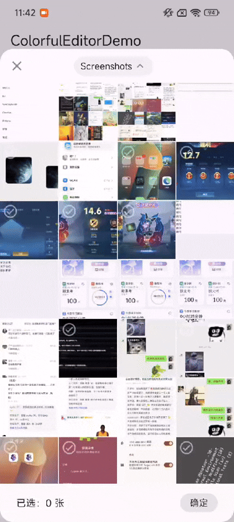

# byr_image_picker

Android自定义image_picker，自带权限控制，拥有简洁的界面，和协程加速，可以减少MethodChannel带来的内存负担和数据交换的时间（基于原生实现）

## 展示



## 原理介绍

本插件使用**Jetpack Compose**开发UI，通过MethodChannel调用函数获得flutterFragmentActvity后通过`addContentView()`拉起Compose View

根据用户的选择将图片通过uri保存文件流到cache，再利用MethodChannel回传绝对地址供flutter调用

因为调用的是**绝对地址**，极大的促进了flutter的多平台统一性（因为安卓对绝对地址读取有沙箱限制，但是私有目录的绝对地址是可以调用的）

而且只传绝对地址的设计（多选就是绝对地址列表），让MethodChannel几乎不会发生内存泄露

## AddContentView

因为实现比较简单，故直接利用`addContentView()`加入视图

## 权限管理

Android 14之后采用更加严格的权限管理，用户可以通过选择“拒绝”、“部分照片可见”、“全部照片可见”三种方式给软件赋予照片权限，本插件采取三种判断：
- 若用户拒绝相册读取权限：使用系统自带的image picker获取图片
- 若用户选择部分照片可见：虽然会弹出自定义的image picker但是会有提示，建议用户访问所有照片，因为如果选择部分照片可见会让用户经历两个image picker导致体验不佳
- 若用户选择全部照片可见：使用自定义image picker

> Note: 经过真机测试，MIUI和HyperOS系统的权限照明灯系统设计可能会误报读取照片权限次数，实际只在弹出image picker的时候获取一次相册读取权限

## 性能优化设计

采用coil3的`AsyncImage()`加载图片的略缩图和`LazyVerticalGrid()`懒加载减少性能开销

若使用**多选图片**的方式（假设选择100张图片）会利用**协程并发**将图片加载到cache然后传回含有100个地址的列表

## 使用方式

导入插件：

```
// pubspec.yaml添加依赖
dependencies:
  byr_image_picker:
    git: https://github.com/SpeechlessMatt/byr_image_picker.git
```

根目录下执行：

```bash
flutter pub get
```

> 注意：flutter默认分支(stable)的android\app\src\main\kotlin\...\MainActivity.kt**使用的是老版本的FlutterActivity而不是新版(master,main分支)的FlutterFragmentActivity**，我们需要手动添加并修改项目的android\app\src\...\MainActivity.kt：

```kotlin
// MainActivity.kt
// 加上这一句
import io.flutter.embedding.android.FlutterFragmentActivity

// 本来是class MainActivity : FlutterActivity()，改成如下所示：
class MainActivity : FlutterFragmentActivity()
```

---

**调用方法：**

单选模式下使用`getSelectedPhotoPath()`:

```dart
try {
    final pickedPath = await ByrImagePicker.getSelectedPhotoPath();
} on PlatformException catch (e) {
    log("PlatformException ${e.message}");
}
```

返回`String`或`null`

多选模式下使用`getSelectedPhotoPaths(int maxSelection)`:

```dart
try {
    final pickedPath = await ByrImagePicker.getSelectedPhotoPaths(10);
} on PlatformException catch (e) {
    log("PlatformException ${e.message}");
}
```

返回`List<String>`或`null`

## 可能遇到的问题

1. debug的时候图片加载速度还是感觉卡顿

解决方法：通过build release性能将极大幅度优化，卡顿感为0

2. 多选模式下，安卓底部小白条很丑，遮挡住了多选栏的一部分


解决方法：由于安卓的底部小白条是国内厂商对安卓的魔改，沉浸小白条需要在activity层面上实现，由于使用`addContentView`的方式，本插件不应该适配小白条沉浸，但是仍然提供解决方案：

像上面替换`FlutterActivity`一样，这里将为项目的`FlutterFragmentActivity`添加小白条沉浸的兼容（该兼容可以让整个app实现小白条沉浸）

```kotlin
// MainActivity.kt
// 加上这几句
import android.os.Bundle
import android.view.WindowManager
import androidx.activity.enableEdgeToEdge

// 为MainActivity添加如下代码：
class MainActivity : FlutterFragmentActivity() {
    override fun onCreate(savedInstanceState: Bundle?) {
        enableEdgeToEdge() // 关键点1
        window.setFlags(WindowManager.LayoutParams.FLAG_LAYOUT_NO_LIMITS,
            WindowManager.LayoutParams.FLAG_LAYOUT_NO_LIMITS) // 关键点2
        super.onCreate(savedInstanceState)
    }
}
```


(你看到底部是圆角可能觉得还是不够完美但是其实是截屏的问题，真机上不会显示出来)

---

## 未来将完善

1. 返回的多选不具有记忆功能的问题
2. 也许fragment + Intent也挺不错的，毕竟这次想尝试点不同的技术路线
3. 暂时不具有选择视频的问题
4. 相册封面
5. 全部照片栏目
6. 将camera、screenshots专辑名字部分翻译成人话